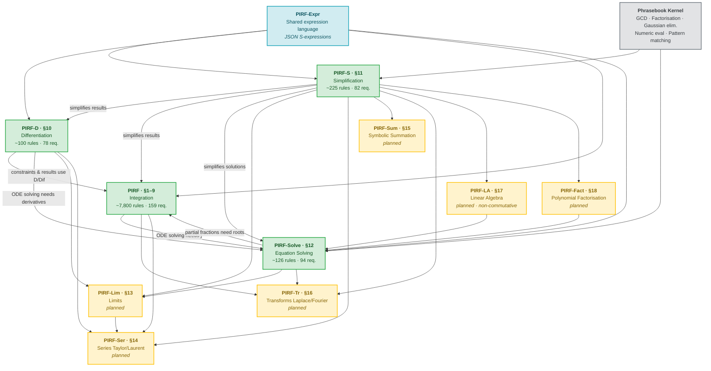
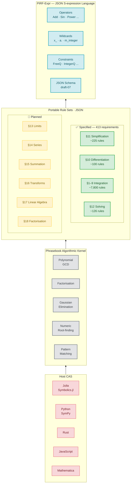
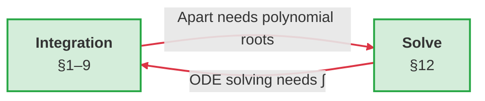
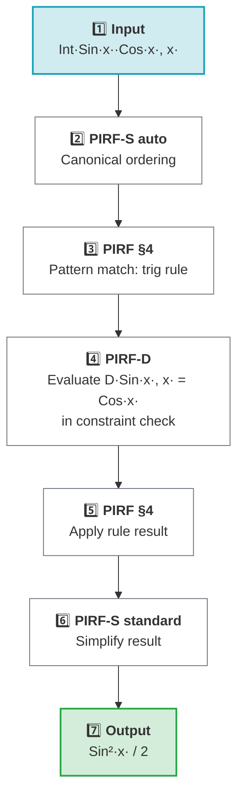
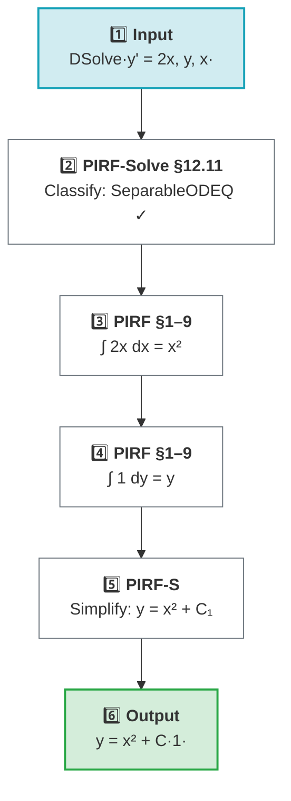
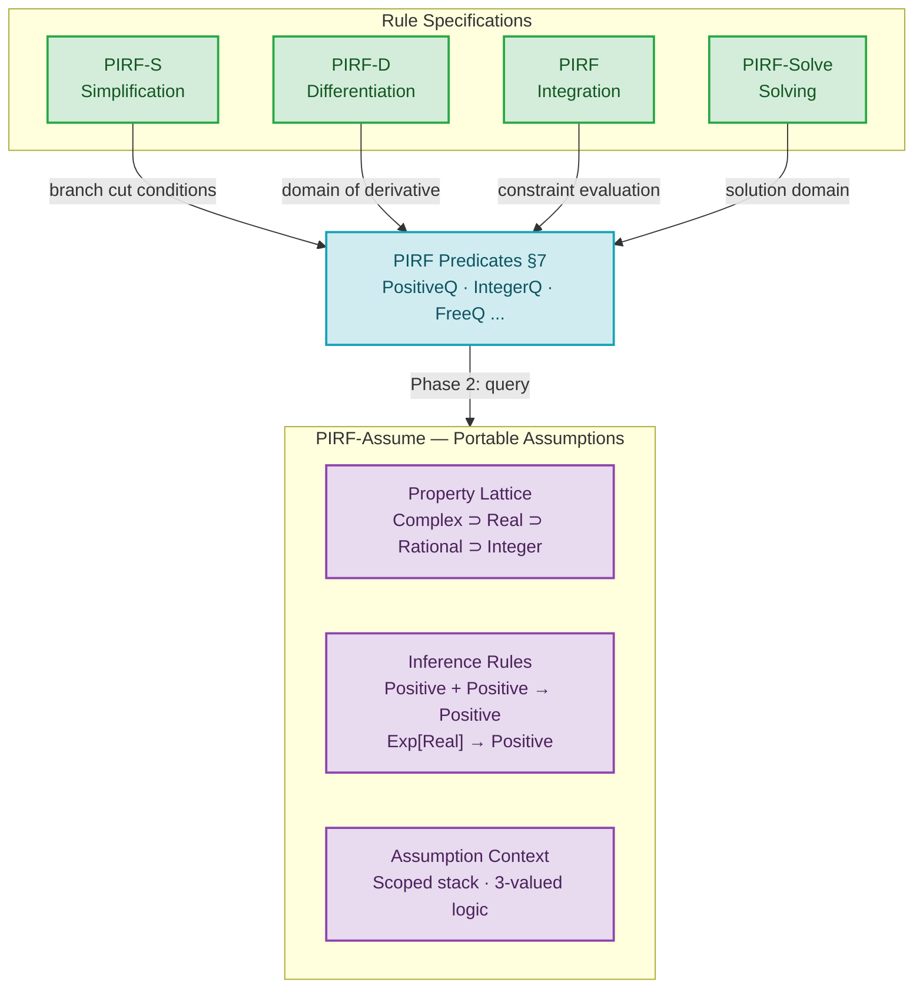

# PIRF — Specification Dependency Diagrams

## 1. Dependency Graph

All specifications and their inter-dependencies. Green = completed, yellow = planned.

---

## 2. Layered Architecture

The stack from host CAS down to the shared expression language.

---

## 3. Circular Dependency & Evaluation Flows

### 3a. The Solve ↔ Integration Cycle

The two specs have a mutual dependency, but via **distinct call paths** that never recurse into each other.

### 3b. Integration Example — ∫ sin(x)·cos(x) dx

### 3c. ODE Example — DSolve[y' = 2x, y, x]

---

---

## 4. PIRF-Assume — The Assumption Foundation

PIRF-Assume sits **below** all rule specs, providing the property inference
that rules query via predicates.

---

## Summary

| Spec | Section | Rules (est.) | Requirements | Status |
|------|---------|-------------|--------------|--------|
| **PIRF-Assume** (Assumptions) | §A | ~60 inference | 61 | ✅ |
| **PIRF** (Integration) | §1–9 | ~7,800 | 159 | ✅ |
| **PIRF-D** (Differentiation) | §10 | ~100 | 78 | ✅ |
| **PIRF-S** (Simplification) | §11 | ~225 | 82 | ✅ |
| **PIRF-Solve** (Solving) | §12 | ~126 | 94 | ✅ |
| **PIRF-Lim** (Limits) | §13 | — | — | 🔲 |
| **PIRF-Ser** (Series) | §14 | — | — | 🔲 |
| **PIRF-Sum** (Summation) | §15 | — | — | 🔲 |
| **PIRF-Tr** (Transforms) | §16 | — | — | 🔲 |
| **PIRF-LA** (Linear Algebra) | §17 | — | — | 🔲 |
| **PIRF-Fact** (Factorisation) | §18 | — | — | 🔲 |
| **Total (specified)** | | **~8,311** | **474** | |
