# PIRF — Specification Dependency Diagrams

## 1. Dependency Graph

All specifications and their inter-dependencies. Green = completed, yellow = planned.

```mermaid
graph TD
    EXPR["<b>PIRF-Expr</b><br/>Shared expression language<br/><i>JSON S-expressions</i>"]

    PB["<b>Phrasebook Kernel</b><br/>GCD · Factorisation · Gaussian elim.<br/>Numeric eval · Pattern matching"]

    S["<b>PIRF-S · §11</b><br/>Simplification<br/>~225 rules · 82 req."]
    D["<b>PIRF-D · §10</b><br/>Differentiation<br/>~100 rules · 78 req."]
    I["<b>PIRF · §1–9</b><br/>Integration<br/>~7,800 rules · 159 req."]
    SOLVE["<b>PIRF-Solve · §12</b><br/>Equation Solving<br/>~126 rules · 94 req."]

    LIM["<b>PIRF-Lim · §13</b><br/>Limits<br/><i>planned</i>"]
    SER["<b>PIRF-Ser · §14</b><br/>Series Taylor/Laurent<br/><i>planned</i>"]
    SUM["<b>PIRF-Sum · §15</b><br/>Symbolic Summation<br/><i>planned</i>"]
    TR["<b>PIRF-Tr · §16</b><br/>Transforms Laplace/Fourier<br/><i>planned</i>"]
    LA["<b>PIRF-LA · §17</b><br/>Linear Algebra<br/><i>planned · non-commutative</i>"]
    FACT["<b>PIRF-Fact · §18</b><br/>Polynomial Factorisation<br/><i>planned</i>"]

    EXPR --> S
    EXPR --> D
    EXPR --> I
    EXPR --> SOLVE

    PB --> S
    PB --> SOLVE

    S -->|"simplifies results"| D
    S -->|"simplifies results"| I
    S -->|"simplifies solutions"| SOLVE

    D -->|"constraints & results use D/Dif"| I
    D -->|"ODE solving needs derivatives"| SOLVE

    I -->|"ODE solving needs ∫"| SOLVE
    SOLVE -->|"partial fractions need roots"| I

    S --> LIM
    S --> SER
    S --> SUM
    S --> TR
    S --> LA
    S --> FACT

    D --> LIM
    D --> SER

    I --> TR
    I --> SER

    SOLVE --> LIM
    SOLVE --> TR

    LIM --> SER
    FACT --> SOLVE
    LA --> SOLVE

    classDef done fill:#d4edda,stroke:#28a745,stroke-width:2px,color:#155724
    classDef planned fill:#fff3cd,stroke:#ffc107,stroke-width:2px,color:#856404
    classDef foundation fill:#d1ecf1,stroke:#17a2b8,stroke-width:2px,color:#0c5460
    classDef kernel fill:#e2e3e5,stroke:#6c757d,stroke-width:2px,color:#383d41

    class S,D,I,SOLVE done
    class LIM,SER,SUM,TR,LA,FACT planned
    class EXPR foundation
    class PB kernel
```

---

## 2. Layered Architecture

The stack from host CAS down to the shared expression language.

```mermaid
graph BT
    subgraph HOST["Host CAS"]
        direction LR
        H1["Julia<br/>Symbolics.jl"]
        H2["Python<br/>SymPy"]
        H3["Rust"]
        H4["JavaScript"]
        H5["Mathematica"]
    end

    subgraph KERNEL["Phrasebook Algorithmic Kernel"]
        direction LR
        K1["Polynomial<br/>GCD"]
        K2["Factorisation"]
        K3["Gaussian<br/>Elimination"]
        K4["Numeric<br/>Root-finding"]
        K5["Pattern<br/>Matching"]
    end

    subgraph RULES["Portable Rule Sets · JSON"]
        direction TB

        subgraph DONE["✅ Specified — 413 requirements"]
            direction LR
            RS["§11 Simplification<br/>~225 rules"]
            RD["§10 Differentiation<br/>~100 rules"]
            RI["§1–9 Integration<br/>~7,800 rules"]
            RV["§12 Solving<br/>~126 rules"]
        end

        subgraph PLAN["🔲 Planned"]
            direction LR
            RL["§13 Limits"]
            RE["§14 Series"]
            RM["§15 Summation"]
            RT["§16 Transforms"]
            RA["§17 Linear Algebra"]
            RF["§18 Factorisation"]
        end
    end

    subgraph FOUNDATION["PIRF-Expr — JSON S-expression Language"]
        direction LR
        F1["Operators<br/>Add · Sin · Power ..."]
        F2["Wildcards<br/>x_ · a. · m_integer"]
        F3["Constraints<br/>FreeQ · IntegerQ ..."]
        F4["JSON Schema<br/>draft-07"]
    end

    HOST --> KERNEL
    KERNEL --> RULES
    RULES --> FOUNDATION

    classDef done fill:#d4edda,stroke:#28a745,stroke-width:2px,color:#155724
    classDef planned fill:#fff3cd,stroke:#ffc107,stroke-width:1px,color:#856404
    classDef kernel fill:#e2e3e5,stroke:#6c757d,stroke-width:2px,color:#383d41
    classDef host fill:#f8d7da,stroke:#dc3545,stroke-width:1px,color:#721c24
    classDef foundation fill:#d1ecf1,stroke:#17a2b8,stroke-width:2px,color:#0c5460

    class RS,RD,RI,RV done
    class RL,RE,RM,RT,RA,RF planned
    class K1,K2,K3,K4,K5 kernel
    class H1,H2,H3,H4,H5 host
    class F1,F2,F3,F4 foundation
```

---

## 3. Circular Dependency & Evaluation Flows

### 3a. The Solve ↔ Integration Cycle

The two specs have a mutual dependency, but via **distinct call paths** that never recurse into each other.

### 3b. Integration Example — ∫ sin(x)·cos(x) dx

```mermaid
graph TB
    E1["1️⃣ <b>Input</b><br/>Int·Sin·x··Cos·x·, x·"]
    E2["2️⃣ <b>PIRF-S auto</b><br/>Canonical ordering"]
    E3["3️⃣ <b>PIRF §4</b><br/>Pattern match: trig rule"]
    E4["4️⃣ <b>PIRF-D</b><br/>Evaluate D·Sin·x·, x· = Cos·x·<br/>in constraint check"]
    E5["5️⃣ <b>PIRF §4</b><br/>Apply rule result"]
    E6["6️⃣ <b>PIRF-S standard</b><br/>Simplify result"]
    E7["7️⃣ <b>Output</b><br/>Sin²·x· / 2"]

    E1 --> E2 --> E3 --> E4 --> E5 --> E6 --> E7

    classDef input fill:#d1ecf1,stroke:#17a2b8,stroke-width:2px
    classDef output fill:#d4edda,stroke:#28a745,stroke-width:2px
    classDef process fill:#fff,stroke:#6c757d,stroke-width:1px

    class E1 input
    class E7 output
    class E2,E3,E4,E5,E6 process
```

### 3c. ODE Example — DSolve[y' = 2x, y, x]

```mermaid
graph TB
    O1["1️⃣ <b>Input</b><br/>DSolve·y' = 2x, y, x·"]
    O2["2️⃣ <b>PIRF-Solve §12.11</b><br/>Classify: SeparableODEQ ✓"]
    O3["3️⃣ <b>PIRF §1–9</b><br/>∫ 2x dx = x²"]
    O4["4️⃣ <b>PIRF §1–9</b><br/>∫ 1 dy = y"]
    O5["5️⃣ <b>PIRF-S</b><br/>Simplify: y = x² + C₁"]
    O6["6️⃣ <b>Output</b><br/>y = x² + C·1·"]

    O1 --> O2 --> O3 --> O4 --> O5 --> O6

    classDef input fill:#d1ecf1,stroke:#17a2b8,stroke-width:2px
    classDef output fill:#d4edda,stroke:#28a745,stroke-width:2px
    classDef process fill:#fff,stroke:#6c757d,stroke-width:1px

    class O1 input
    class O6 output
    class O2,O3,O4,O5 process
```

---

---

## 4. PIRF-Assume — The Assumption Foundation

PIRF-Assume sits **below** all rule specs, providing the property inference
that rules query via predicates.

---

## Summary

| Spec | Section | Rules (est.) | Requirements | Status |
|------|---------|-------------|--------------|--------|
| **PIRF-Assume** (Assumptions) | §A | ~60 inference | 61 | ✅ |
| **PIRF** (Integration) | §1–9 | ~7,800 | 159 | ✅ |
| **PIRF-D** (Differentiation) | §10 | ~100 | 78 | ✅ |
| **PIRF-S** (Simplification) | §11 | ~225 | 82 | ✅ |
| **PIRF-Solve** (Solving) | §12 | ~126 | 94 | ✅ |
| **PIRF-Lim** (Limits) | §13 | — | — | 🔲 |
| **PIRF-Ser** (Series) | §14 | — | — | 🔲 |
| **PIRF-Sum** (Summation) | §15 | — | — | 🔲 |
| **PIRF-Tr** (Transforms) | §16 | — | — | 🔲 |
| **PIRF-LA** (Linear Algebra) | §17 | — | — | 🔲 |
| **PIRF-Fact** (Factorisation) | §18 | — | — | 🔲 |
| **Total (specified)** | | **~8,311** | **474** | |
